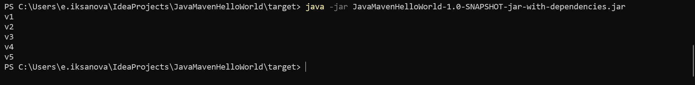
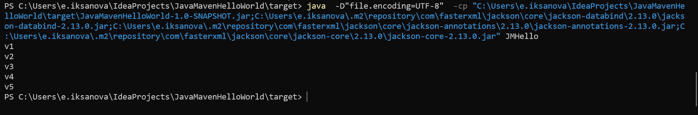

## Сборка
`mvn clean package`

## Запуск
### Fat jar
`java -jar ./target/JavaMavenHelloWorld-1.0-SNAPSHOT-jar-with-dependencies.jar`


### jar
```java -cp ./target/JavaMavenHelloWorld-1.0-SNAPSHOT.jar;~/.m2/repository/com/fasterxml/jackson/core/jackson-databind/2.13.0/jackson-databind-2.13.0.jar;~/.m2/repository/com/fasterxml/jackson/core/core/jackson-annotations/2.13.0/jackson-annotations-2.13.0.jar;~/.m2/repository/com/fasterxml/jackson/core/core/jackson-core/2.13.0/jackson-core-2.13.0.jar JMHello```
